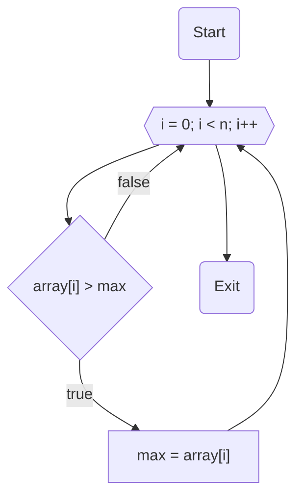

# НИЯУ МИФИ. Лабораторная работа №1. Краснопольский Иван, Б21-525. 2023

## Используемая система

### Используемая система:

```text
System:
  Kernel: 6.2.0-20-generic arch: x86_64 bits: 64 compiler: gcc v: 12.2.0
    Distro: Ubuntu 23.04 (Lunar Lobster)
CPU:
  Info: 32x 1-core model: Intel Xeon (Icelake) bits: 64 type: SMP smt: <unsupported>
    arch: Tremont Snow Ridge rev: 0 cache: L1: 32x 64 KiB (2 MiB) L2: 32x 4 MiB (128 MiB)
    L3: 32x 16 MiB (512 MiB)
  Speed (MHz): avg: 2195 min/max: N/A cores: 1: 2195 2: 2195 3: 2195 4: 2195 5: 2195 6: 2195
    7: 2195 8: 2195 9: 2195 10: 2195 11: 2195 12: 2195 13: 2195 14: 2195 15: 2195 16: 2195 17: 2195
    18: 2195 19: 2195 20: 2195 21: 2195 22: 2195 23: 2195 24: 2195 25: 2195 26: 2195 27: 2195
    28: 2195 29: 2195 30: 2195 31: 2195 32: 2195 bogomips: 140469
```

### Среда разработки

- Язык программирования C
- Версия gcc: `11.4.0`
- Версия OpenMP: `Release: 201511 OpenMP: 4.5`

## Анализ алгоритма

### Описание принципа работы алгоритма

#### Инициализация

- Установка начального значения (seed) для генератора случайных чисел. Это обеспечивает воспроизводимость результатов
  при каждом запуске программы.
- Определение основных параметров, таких как размер массива (`count`), количество потоков (`threads`) и seed для
  RNG (`random_seed`).

#### Создание и заполнение массива

- Выделяется динамическая память под массив `array` размером `count`.
- Цикл заполняет массив `array` случайными числами, сгенерированными с использованием ранее инициализированного RNG.

#### Поиск максимального элемента с использованием OpenMP

- С помощью директивы `#pragma omp parallel` запускается параллельная секция. Эта директива указывает компилятору на
  начало блока кода, который должен выполняться параллельно на указанном количестве потоков (`threads`). В этом блоке
  каждый поток работает независимо от других.
- Директива `#pragma omp for` непосредственно перед циклом `for` распределяет итерации цикла между активными потоками.
  Это означает, что каждый поток выполняет часть итераций цикла, обрабатывая различные сегменты массива для поиска
  максимального элемента.
- Внутри каждого потока идет сравнение элементов его сегмента массива с локальной переменной `max` этого потока. После
  завершения всех итераций цикла происходит операция редукции `reduction(max: max)`, которая собирает локальные
  максимумы от всех потоков и определяет окончательный глобальный максимум.
- После завершения параллельного блока, переменная `max` содержит максимальное значение из всех сегментов массива,
  обработанных различными потоками.

#### Вывод результата

- Выводится максимальное значение, найденное в массиве, в консоль.

### Оценка сложности

#### Количество элементов в массиве: $n$

#### Количество потоков: $p$

#### Сложность последовательного алгоритма: $O(n)$

#### Сложность параллельного алгоритма: $O(\frac{n}{p})$

#### Теоретическое ускорение: $p$ раз

### Блок-схема



### Анализ OpenMP директив

`#pragma omp parallel`

- **Смысл**: Создает параллельный блок кода, который выполняется одновременно на нескольких потоках.
- **Область кода**: Блок кода внутри фигурных скобок после директивы.
- **Роль**: Позволяет одновременно искать максимальный элемент в разных частях массива, ускоряя процесс.
- **Влияние отсутствия**: Без этой директивы код выполнялся бы последовательно, что существенно увеличило бы время
  выполнения.

`#pragma omp for`

- **Смысл**: Распределяет итерации цикла `for` между потоками параллельной секции.
- **Область кода**: Цикл `for` непосредственно после директивы.
- **Роль**: Обеспечивает эффективное распределение работы по поиску максимального элемента между потоками.
- **Влияние отсутствия**: Без этой директивы все потоки выполняли бы одни и те же итерации цикла, что не привело бы к
  ускорению работы.

`reduction(max: max)`

- **Смысл**: Операция редукции для нахождения максимального значения среди всех потоков.
- **Область кода**: Включена в директиву `#pragma omp parallel`.
- **Роль**: Гарантирует, что итоговое значение `max` будет максимальным среди всех элементов, обработанных разными
  потоками.
- **Влияние отсутствия**: Без редукции каждый поток имел бы свою копию переменной `max`, и окончательный результат не
  отражал бы истинный максимум массива.

`default(none)`

- **Смысл**: Указывает, что все переменные должны быть явно заданы в директивах `shared`, `private` и т.д.
- **Область кода**: Включена в директиву `#pragma omp parallel`.
- **Роль**: Повышает безопасность кода, требуя явного определения области видимости переменных.
- **Влияние отсутствия**: Без этой директивы могли бы возникнуть проблемы с видимостью переменных и их случайный захват
  из глобального контекста.

## Вычисления

- Последовательный алгоритм

  ```text
  Average time: 0.030050
  ```

- <details>
  <summary>Параллельный алгоритм</summary>

  ```text
  Threads	Time
  1	0.030894
  2	0.015713
  3	0.010437
  4	0.008325
  5	0.006337
  6	0.005347
  7	0.005204
  8	0.004569
  9	0.003781
  10	0.003587
  11	0.003097
  12	0.002961
  13	0.002867
  14	0.002748
  15	0.002467
  16	0.002368
  17	0.002306
  18	0.002100
  19	0.002097
  20	0.002015
  21	0.001899
  22	0.001908
  23	0.001780
  24	0.001746
  25	0.001654
  26	0.001618
  27	0.001566
  28	0.001518
  29	0.001501
  30	0.001457
  31	0.001409
  32	0.001362
  33	0.002303
  34	0.002372
  35	0.002396
  36	0.002487
  37	0.002395
  38	0.002439
  39	0.002390
  40	0.002384
  41	0.002375
  42	0.002344
  43	0.002260
  44	0.002324
  45	0.002420
  46	0.002318
  47	0.002392
  48	0.002323
  49	0.002340
  50	0.002430
  51	0.002476
  52	0.002411
  53	0.002349
  54	0.002461
  55	0.002438
  56	0.002366
  57	0.002457
  58	0.002300
  59	0.002407
  60	0.002248
  61	0.002318
  62	0.002370
  63	0.002381
  64	0.002364
  ```

</details>

## Экспериментальные данные

### Зависимость времени от количества потоков


### Зависимость ускорения от количества потоков


### Зависимость эффективности работы программы от количества потоков


## Заключение

В ходе данной работы с использованием библиотеки OpenMP в языке программирования C было установлено то, что реальное
время работы и ускорение за счет использования нескольких потоков может отличаться от ожидаемого времени работы
программы. Можно сделать вывод, что при работе с многопоточной обработкой важно учитывать не только количество потоков,
но и физические характеристики системы, а также природу задачи. В контексте данной работы, использование более четырёх
потоков не приводило к дополнительному ускорению, что подчёркивает важность оптимизации количества потоков в
соответствии с аппаратными возможностями системы и характером выполняемых вычислений.

## Приложение

### Последовательная программа

<details>
  <summary>Исходный код последовательной программы</summary>

```c++
#include <stdio.h>
#include <stdlib.h>
#include <omp.h>

int main(int argc, char **argv) {
    const int count = 10000000;
    const int random_seed = 1337;
    const int iterations = 25;

    srand(random_seed);

    int max;
    int *array = malloc(count * sizeof(int));
    for (int i = 0; i < count; i++) { array[i] = rand(); }

    double start_time, end_time, total = 0;

    for (int j = 0; j < iterations; j++) {
        max = -1;
        for (int i = 0; i < count; i++) { array[i] = rand(); }
        start_time = omp_get_wtime();
        for (int i = 0; i < count; i++) {
            if (array[i] > max) {
                max = array[i];
            }
        }
        end_time = omp_get_wtime();
        total += end_time - start_time;
    }

    printf("Average time: %f\n", total / (double) iterations);


    free(array);
    return 0;
}
```

</details>

### Параллельная программа

<details>
  <summary>Исходный код параллельной программы, количество потоков от 1 до 64</summary>

```c++
#include <stdio.h>
#include <stdlib.h>
#include <omp.h>

int main(int argc, char **argv) {
    const int count = 10000000;
    const int random_seed = 1337;
    const int iterations = 25;
    const int max_threads = 64;

    srand(random_seed);

    int max;
    int *array = malloc(count * sizeof(int));

    double start_time, end_time, total;
    printf("Threads\tTime\n");
    for (int threads = 1; threads <= max_threads; threads++) {
        total = 0;

        for (int j = 0; j < iterations; j++) {
            for (int i = 0; i < count; i++) { array[i] = rand(); }
            max = -1;
            start_time = omp_get_wtime();
#pragma omp parallel num_threads(threads) shared(array, count) reduction(max: max) default(none)
            {
#pragma omp for
                for (int i = 0; i < count; i++) {
                    if (array[i] > max) {
                        max = array[i];
                    }
                }
            }
            end_time = omp_get_wtime();
            total += end_time - start_time;
        }
        printf("%d\t%f\n", threads, total / (double) iterations);
    }

    free(array);
    return 0;
}
```

</details>
