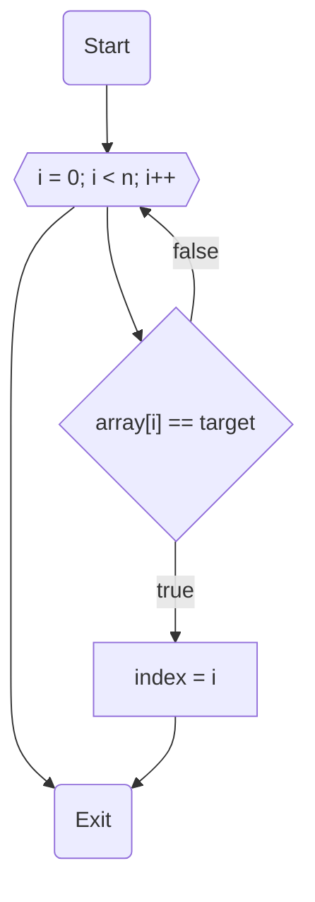

# НИЯУ МИФИ. Лабораторная работа №2. Краснопольский Иван, Б21-525. 2023

## Используемая система

### Используемая система:

```text
System:
  Kernel: 6.2.0-20-generic arch: x86_64 bits: 64 compiler: gcc v: 12.2.0
    Distro: Ubuntu 23.04 (Lunar Lobster)
CPU:
  Info: 32x 1-core model: Intel Xeon (Icelake) bits: 64 type: SMP smt: <unsupported>
    arch: Tremont Snow Ridge rev: 0 cache: L1: 32x 64 KiB (2 MiB) L2: 32x 4 MiB (128 MiB)
    L3: 32x 16 MiB (512 MiB)
  Speed (MHz): avg: 2195 min/max: N/A cores: 1: 2195 2: 2195 3: 2195 4: 2195 5: 2195 6: 2195
    7: 2195 8: 2195 9: 2195 10: 2195 11: 2195 12: 2195 13: 2195 14: 2195 15: 2195 16: 2195 17: 2195
    18: 2195 19: 2195 20: 2195 21: 2195 22: 2195 23: 2195 24: 2195 25: 2195 26: 2195 27: 2195
    28: 2195 29: 2195 30: 2195 31: 2195 32: 2195 bogomips: 140469
```

### Среда разработки

- Язык программирования C
- Версия gcc: `11.4.0`
- Версия OpenMP: `Release: 201511 OpenMP: 4.5`

## Анализ алгоритма

### Описание принципа работы алгоритма

#### Инициализация

- Установка начального значения (seed) для генератора случайных чисел. Это обеспечивает воспроизводимость результатов
  при каждом запуске программы.
- Определение основных параметров, таких как размер массива (`count`), количество потоков (`threads`) и seed для
  RNG (`random_seed`).

#### Создание и заполнение массива

- Выделяется динамическая память под массив `array` размером `count`.
- Цикл заполняет массив `array` случайными числами, сгенерированными с использованием ранее инициализированного RNG.

#### Поиск индекса искомого элемента

- Запускается цикл, очередной шаг которого при совпадении текущего элемента и `target` записывает текущий индекс в
  переменную `index` и завершает цикл.

#### Вывод результата

- Выводится максимальное значение, найденное в массиве, в консоль.

### Оценка сложности

#### Количество элементов в массиве: $n$

#### Количество потоков: $p$

#### Сложность последовательного алгоритма:

- В лучшем случае: $O(1)$
- В худшем случае: $O(n)$
- В среднем: $O(\frac{n}{2})$

#### Сложность параллельного алгоритма в среднем случае: $O(\frac{n}{2p})$

#### Теоретическое ускорение: $p$ раз

### Блок-схема



### Анализ OpenMP директив

`#pragma omp parallel for`

- **Цель**: Создание параллельной области для разделения работы цикла между несколькими потоками.
- **Обоснование**: Используется для параллельного поиска элемента в массиве. Потоки выполняют поиск в разных частях
  массива одновременно.

`omp_get_wtime()`

- **Цель**: Получение текущего времени (в секундах) для измерения времени выполнения.
- **Обоснование**: Измеряет время выполнения поиска в массиве для различного количества потоков.

## Вычисления

- Последовательный алгоритм

  ```text
  Average time: 0.030857
  ```

- <details>
  <summary>Параллельный алгоритм</summary>

  ```text
  Threads	Time
  1	0.029905
  2	0.014969
  3	0.009970
  4	0.007469
  5	0.006017
  6	0.005831
  7	0.004299
  8	0.003776
  9	0.003336
  10	0.003017
  11	0.002738
  12	0.002527
  13	0.002844
  14	0.002646
  15	0.002467
  16	0.002318
  17	0.002193
  18	0.002109
  19	0.001974
  20	0.001875
  21	0.001775
  22	0.001712
  23	0.001630
  24	0.001572
  25	0.001521
  26	0.001451
  27	0.001391
  28	0.001352
  29	0.001329
  30	0.001265
  31	0.001232
  32	0.001188
  33	0.002075
  34	0.002078
  35	0.002061
  36	0.001951
  37	0.001993
  38	0.001924
  39	0.002040
  40	0.001947
  41	0.001904
  42	0.002017
  43	0.001834
  44	0.001994
  45	0.001965
  46	0.001913
  47	0.002056
  48	0.001987
  49	0.001928
  50	0.002008
  51	0.001923
  52	0.001872
  53	0.001932
  54	0.001885
  55	0.001942
  56	0.001854
  57	0.001893
  58	0.001948
  59	0.001875
  60	0.001837
  61	0.001811
  62	0.001830
  63	0.001807
  64	0.001886
  ```

</details>

## Экспериментальные данные

### Зависимость времени от количества потоков


### Зависимость ускорения от количества потоков


### Зависимость эффективности работы программы от количества потоков


## Заключение

В рамках данного исследования, проведенного с применением библиотеки OpenMP на языке C, были выявлены два ключевых
момента: невозможность использования инструкции `break` в циклах OpenMP и факт, что без альтернатив `break` при
распределении задач на несколько потоков в определенных ситуациях время выполнения может возрастать, поскольку в этих
случаях стандартный однопоточный алгоритм окажется более эффективным.

## Приложение

### Последовательная программа

<details>
  <summary>Исходный код последовательной программы</summary>

```c++
#include <stdio.h>
#include <stdlib.h>
#include <omp.h>

int main(int argc, char **argv) {
    const int count = 10000000;
    const int random_seed = 1337;
    const int attempts = 25;
    const int target = 1337;

    srand(random_seed);

    int index;
    int *array = malloc(count * sizeof(int));
    for (int i = 0; i < count; i++) { array[i] = rand(); }

    double start_time, end_time, total = 0;

    for (int j = 0; j < attempts; j++) {
        index = -1;
        start_time = omp_get_wtime();
        for (int i = 0; i < count; i++) {
            if (array[i] == target) {
                index = i;
                break;
            }
        }
        end_time = omp_get_wtime();
        total += end_time - start_time;
    }
    printf("Average time: %f\n", total / (double) attempts);

    free(array);
    return 0;
}
```

</details>

### Параллельная программа

<details>
  <summary>Исходный код параллельной программы, количество потоков от 1 до 64</summary>

```c++
#include <stdio.h>
#include <stdlib.h>
#include <omp.h>

int main(int argc, char **argv) {
    const int count = 10000000;
    const int random_seed = 1337;
    const int iterations = 25;
    const int max_threads = 64;
    const int target = 1337;

    srand(random_seed);

    int index;
    int *array = malloc(count * sizeof(int));;

    double start_time, end_time, total;
    printf("Threads\tTime\n");
    for (int threads = 1; threads <= max_threads; threads++) {
        total = 0;

        for (int j = 0; j < iterations; j++) {
            for (int i = 0; i < count; i++) { array[i] = rand(); }
            index = -1;
            start_time = omp_get_wtime();
#pragma omp parallel num_threads(threads) reduction(min: index)
            {
#pragma omp for
                for (int i = 0; i < count; i++) {
                    if (array[i] == target) {
                        index = i;
                        i = count; // Instead of break
                    }
                }
            }
            end_time = omp_get_wtime();
            total += end_time - start_time;
        }
        printf("%d\t%f\n", threads, total / (double) iterations);
    }

    free(array);
    return 0;
}
```

</details>
