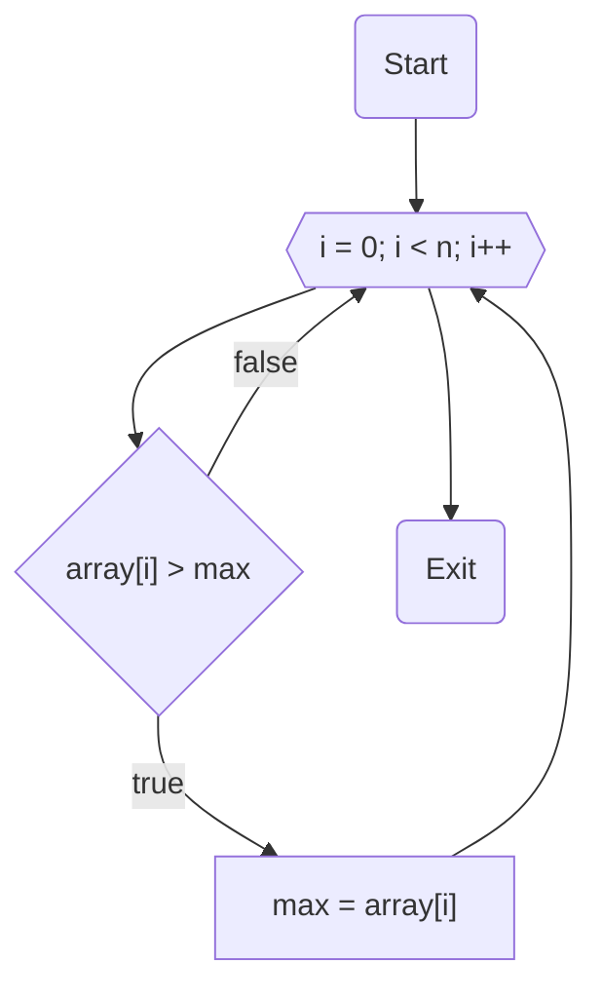

# НИЯУ МИФИ. Лабораторная работа №5. Краснопольский Иван, Б21-525. 2023

## Используемая система

### Используемая система:

```text
System:
  Kernel: 6.2.0-20-generic arch: x86_64 bits: 64 compiler: gcc v: 12.2.0
    Distro: Ubuntu 23.04 (Lunar Lobster)
CPU:
  Info: 32x 1-core model: Intel Xeon (Icelake) bits: 64 type: SMP smt: <unsupported>
    arch: Tremont Snow Ridge rev: 0 cache: L1: 32x 64 KiB (2 MiB) L2: 32x 4 MiB (128 MiB)
    L3: 32x 16 MiB (512 MiB)
  Speed (MHz): avg: 2195 min/max: N/A cores: 1: 2195 2: 2195 3: 2195 4: 2195 5: 2195 6: 2195
    7: 2195 8: 2195 9: 2195 10: 2195 11: 2195 12: 2195 13: 2195 14: 2195 15: 2195 16: 2195 17: 2195
    18: 2195 19: 2195 20: 2195 21: 2195 22: 2195 23: 2195 24: 2195 25: 2195 26: 2195 27: 2195
    28: 2195 29: 2195 30: 2195 31: 2195 32: 2195 bogomips: 140469
```

### Среда разработки

- Язык программирования C
- Версия gcc: `11.4.0`
- Версия OpenMP: `Release: 201511 OpenMP: 4.5`
- Версия OpenMPI: `(OpenRTE) 4.1.4`

## Анализ алгоритма

### Описание принципа работы алгоритма

Алгоритм проходит через массив чисел, сравнивая каждое число с текущим наибольшим значением для этого процесса. Если
находится число, превышающее текущий максимум, его значение присваивается переменной `lmax`. Когда заканчивается
циклическая часть процесса, значение `lmax`, полученное в ходе процесса, сопоставляется с `max`, и из них выбирается
большее. В результате самое большое число оказывается в переменной `max`.

### Оценка сложности

#### Количество элементов в массиве: $n$

#### Количество потоков: $p$

#### Сложность последовательного алгоритма: $O(n)$

#### Сложность параллельного алгоритма: $O(\frac{n}{p})$

#### Теоретическое ускорение: $p$ раз

### Блок-схема



## Вычисления

- Последовательный алгоритм

  ```text
  Average time: 0.030050
  ```

- <details>
  <summary>Параллельный алгоритм на OpenMP</summary>

  ```text
  Threads	Time
  1	0.030894
  2	0.015713
  3	0.010437
  4	0.008325
  5	0.006337
  6	0.005347
  7	0.005204
  8	0.004569
  9	0.003781
  10	0.003587
  11	0.003097
  12	0.002961
  13	0.002867
  14	0.002748
  15	0.002467
  16	0.002368
  17	0.002306
  18	0.002100
  19	0.002097
  20	0.002015
  21	0.001899
  22	0.001908
  23	0.001780
  24	0.001746
  25	0.001654
  26	0.001618
  27	0.001566
  28	0.001518
  29	0.001501
  30	0.001457
  31	0.001409
  32	0.001362
  33	0.002303
  34	0.002372
  35	0.002396
  36	0.002487
  37	0.002395
  38	0.002439
  39	0.002390
  40	0.002384
  41	0.002375
  42	0.002344
  43	0.002260
  44	0.002324
  45	0.002420
  46	0.002318
  47	0.002392
  48	0.002323
  49	0.002340
  50	0.002430
  51	0.002476
  52	0.002411
  53	0.002349
  54	0.002461
  55	0.002438
  56	0.002366
  57	0.002457
  58	0.002300
  59	0.002407
  60	0.002248
  61	0.002318
  62	0.002370
  63	0.002381
  64	0.002364
  ```

</details>

- <details>
  <summary>Параллельный алгоритм на MPI</summary>

  ```text
  Threads	Time
  1	0.027952
  2	0.013974
  3	0.009372
  4	0.007132
  5	0.005707
  6	0.004690
  7	0.004023
  8	0.003563
  9	0.003158
  10	0.002885
  11	0.002607
  12	0.002438
  13	0.002233
  14	0.002060
  15	0.001951
  16	0.001925
  17	0.001769
  18	0.001680
  19	0.001551
  20	0.001592
  21	0.001613
  22	0.001492
  23	0.001549
  24	0.001485
  25	0.001347
  26	0.001552
  27	0.001543
  28	0.001520
  29	0.001475
  30	0.001421
  31	0.001400
  32	0.001380
  33	0.002795
  34	0.002973
  35	0.003460
  36	0.003741
  37	0.002995
  38	0.002823
  39	0.002772
  40	0.002522
  41	0.003136
  42	0.003653
  43	0.003021
  44	0.003080
  45	0.003529
  46	0.003532
  47	0.003415
  48	0.003856
  49	0.003566
  50	0.004455
  51	0.004038
  52	0.004129
  53	0.003718
  54	0.004755
  55	0.003730
  56	0.003396
  57	0.004191
  58	0.003401
  59	0.004221
  60	0.003974
  61	0.004332
  62	0.003956
  63	0.004262
  64	0.005747
  ```

</details>

## Экспериментальные данные

### Зависимость времени от количества потоков


### Зависимость ускорения от количества потоков


### Зависимость эффективности работы программы от количества потоков


## Заключение

В рамках проведенного исследования, в котором применялась технология MPI для программирования на C, было выявлено, что
эта технология обеспечивает лишь небольшое ускорение при работе с малым числом потоков. При этом она оказывается менее
эффективной по сравнению с OpenMP при увеличении количества потоков на одном компьютере, так как скорость обработки
данных снижается из-за времени, затрачиваемого на взаимодействие между процессами. Таким образом, MPI лучше подходит для
кластерных вычислений, в то время как OpenMP более эффективен для использования на одном компьютере.

## Приложение

### Последовательная программа

<details>
  <summary>Исходный код последовательной программы</summary>

```c++
#include <stdio.h>
#include <stdlib.h>
#include <omp.h>

int main(int argc, char **argv) {
    const int count = 10000000;
    const int random_seed = 1337;
    const int iterations = 25;

    srand(random_seed);

    int max;
    int *array = malloc(count * sizeof(int));
    for (int i = 0; i < count; i++) { array[i] = rand(); }

    double start_time, end_time, total = 0;

    for (int j = 0; j < iterations; j++) {
        max = -1;
        for (int i = 0; i < count; i++) { array[i] = rand(); }
        start_time = omp_get_wtime();
        for (int i = 0; i < count; i++) {
            if (array[i] > max) {
                max = array[i];
            }
        }
        end_time = omp_get_wtime();
        total += end_time - start_time;
    }

    printf("Average time: %f\n", total / (double) iterations);


    free(array);
    return 0;
}
```

</details>

### Параллельная программа на OpenMP

<details>
  <summary>Исходный код параллельной программы, количество потоков от 1 до 64</summary>

```c++
#include <stdio.h>
#include <stdlib.h>
#include <omp.h>

int main(int argc, char **argv) {
    const int count = 10000000;
    const int random_seed = 1337;
    const int iterations = 25;
    const int max_threads = 64;

    srand(random_seed);

    int max;
    int *array = malloc(count * sizeof(int));

    double start_time, end_time, total;
    printf("Threads\tTime\n");
    for (int threads = 1; threads <= max_threads; threads++) {
        total = 0;

        for (int j = 0; j < iterations; j++) {
            for (int i = 0; i < count; i++) { array[i] = rand(); }
            max = -1;
            start_time = omp_get_wtime();
#pragma omp parallel num_threads(threads) shared(array, count) reduction(max: max) default(none)
            {
#pragma omp for
                for (int i = 0; i < count; i++) {
                    if (array[i] > max) {
                        max = array[i];
                    }
                }
            }
            end_time = omp_get_wtime();
            total += end_time - start_time;
        }
        printf("%d\t%f\n", threads, total / (double) iterations);
    }

    free(array);
    return 0;
}
```

</details>

### Параллельная программа на MPI

<details>
  <summary>Исходный код параллельной программы</summary>

```c++
#include <stdio.h>
#include <stdlib.h>
#include <mpi.h>

int main(int argc, char **argv) {
    const int count = 10000000;
    const int random_seed = 1337;
    const int iterations = 25;

    srand(random_seed);

    int max;
    int *array = (int *) malloc(count * sizeof(int));

    MPI_Init(&argc, &argv);

    int rank, size;
    MPI_Comm_rank(MPI_COMM_WORLD, &rank);
    MPI_Comm_size(MPI_COMM_WORLD, &size);
    int chunk = count / size;

    double start_time, end_time, total = 0;
    for (int iteration = 0; iteration < iterations; iteration++) {
        if (rank == 0) {
            for (int i = 0; i < count; i++) { array[i] = rand(); }
        }

        MPI_Bcast(array, count, MPI_INT, 0, MPI_COMM_WORLD);

        start_time = MPI_Wtime();

        int lmax = array[0];
        for (int i = chunk * rank; i < count && i < chunk * (rank + 1); i++) {
            if (array[i] > lmax) {
                lmax = array[i];
            }
        }

        MPI_Reduce(&lmax, &max, 1, MPI_INT, MPI_MAX, 0, MPI_COMM_WORLD);

        end_time = MPI_Wtime();
        total += end_time - start_time;
    }

    if (rank == 0) {
        printf("%d\t%f\n", size, total / (double) iterations);
    }

    MPI_Finalize();

    free(array);
    return 0;
}
```

</details>

<details>
  <summary>Скрипт для запуска параллельной программы на MPI, количество потоков от 1 до 64</summary>

```bash
#!/bin/bash

EXECUTABLE="./cmake-build-debug/lab"

echo -e "Threads\tTime"

for threads in {1..32}
do
    mpiexec -n $threads $EXECUTABLE
done

for threads in {33..64}
do
    mpiexec -n $threads --oversubscribe $EXECUTABLE
done
```

</details>
