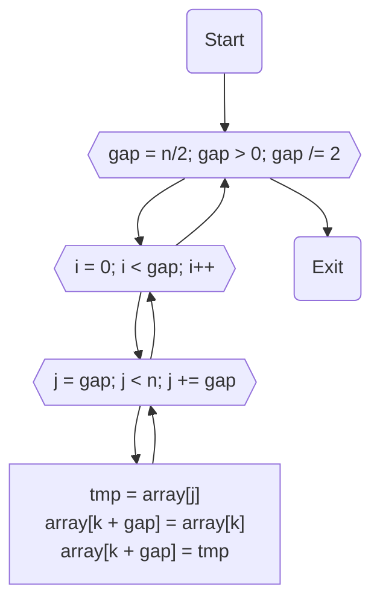

# НИЯУ МИФИ. Лабораторная работа №6. Краснопольский Иван, Б21-525. 2023

## Используемая система

### Используемая система:

```text
System:
  Kernel: 6.2.0-20-generic arch: x86_64 bits: 64 compiler: gcc v: 12.2.0
    Distro: Ubuntu 23.04 (Lunar Lobster)
CPU:
  Info: 32x 1-core model: Intel Xeon (Icelake) bits: 64 type: SMP smt: <unsupported>
    arch: Tremont Snow Ridge rev: 0 cache: L1: 32x 64 KiB (2 MiB) L2: 32x 4 MiB (128 MiB)
    L3: 32x 16 MiB (512 MiB)
  Speed (MHz): avg: 2195 min/max: N/A cores: 1: 2195 2: 2195 3: 2195 4: 2195 5: 2195 6: 2195
    7: 2195 8: 2195 9: 2195 10: 2195 11: 2195 12: 2195 13: 2195 14: 2195 15: 2195 16: 2195 17: 2195
    18: 2195 19: 2195 20: 2195 21: 2195 22: 2195 23: 2195 24: 2195 25: 2195 26: 2195 27: 2195
    28: 2195 29: 2195 30: 2195 31: 2195 32: 2195 bogomips: 140469
```

### Среда разработки

- Язык программирования C
- Версия gcc: `11.4.0`
- Версия OpenMP: `Release: 201511 OpenMP: 4.5`

## Анализ алгоритма

### Принцип работы

Алгоритм разбивает исходный массив `array` на части `larray`, которые сортируются каждым потоком отдельно. Когда
заканчивается циклическая часть процесса, значения `larray`, полученное в ходе процесса, объединяются в `array`. В
результате получается отсортированный массив `array.

### Оценка сложности

#### Количество элементов в массиве: $n$

#### Количество потоков: $p$

#### Сложность последовательного алгоритма:

- Лучший случай: $O(n\cdot\log{n})$
- Худший случай: $O(n^2)$

Лучший случай наступает, когда массив отсортирован.

Худший случай наступает, когда элементы, большие и меньшие медианы,
занимают нечетные и четные позиции соответственно, поскольку они сравниваются только на последнем проходе.

#### Сложность параллельного алгоритма:

Согласно закону Амдала, мы можем рассчитать ускорение по формуле $S = \frac{1}{(1 - q) + \frac{q}{p}}$

Где $q$ — доля программы, которая может быть выполнена параллельно (от 0 до 1). Так как сортировка вставками применяется
к элементам, разделенным фиксированным расстоянием $m$, что обеспечивает независимость обрабатываемых диапазонов длиной
$m$, то эвристически установим коэффициент $q = 0.93$

#### Теоретическое ускорение: $\frac{1}{0.07 + \frac{0.93}{p}}$ раз

### Блок-схема



## Вычисления

- Последовательный алгоритм

  ```text
  Average time: 0.416046
  ```

- <details>
  <summary>Параллельный алгоритм на OpenMP</summary>

  ```text
  Threads	Time
  1	0.422073
  2	0.239992
  3	0.163860
  4	0.131397
  5	0.112196
  6	0.100872
  7	0.092802
  8	0.085901
  9	0.082495
  10	0.075773
  11	0.072917
  12	0.069753
  13	0.067151
  14	0.068663
  15	0.064623
  16	0.066486
  17	0.063429
  18	0.062318
  19	0.062841
  20	0.060233
  21	0.060595
  22	0.059634
  23	0.060252
  24	0.060298
  25	0.059431
  26	0.060186
  27	0.060201
  28	0.056378
  29	0.058620
  30	0.055583
  31	0.053924
  32	0.054786
  33	0.060833
  34	0.060868
  35	0.060875
  36	0.061991
  37	0.062197
  38	0.061413
  39	0.062376
  40	0.061722
  41	0.063052
  42	0.062182
  43	0.062978
  44	0.062303
  45	0.063210
  46	0.062581
  47	0.062241
  48	0.063489
  49	0.062889
  50	0.062838
  51	0.063478
  52	0.063601
  53	0.063215
  54	0.063592
  55	0.063727
  56	0.063571
  57	0.062969
  58	0.063715
  59	0.063546
  60	0.062936
  61	0.063188
  62	0.063272
  63	0.063304
  64	0.063941
  ```

</details>

- <details>
  <summary>Параллельный алгоритм на MPI</summary>

  ```text
  Threads	Time
  1	0.532166
  2	0.323468
  3	0.270758
  4	0.269223
  5	0.236663
  6	0.235389
  7	0.226981
  8	0.282357
  9	0.222618
  10	0.229543
  11	0.222104
  12	0.245677
  13	0.224341
  14	0.230616
  15	0.228318
  16	0.339430
  17	0.233219
  18	0.232123
  19	0.227337
  20	0.246388
  21	0.229519
  22	0.236287
  23	0.234406
  24	0.278679
  25	0.229498
  26	0.238451
  27	0.268589
  28	0.256048
  29	0.232499
  30	0.270512
  31	0.236717
  32	0.493728
  33	0.335955
  34	0.252829
  35	0.300484
  36	0.343874
  37	0.232554
  38	0.314728
  39	0.378895
  40	0.425128
  41	0.235960
  42	0.318436
  43	0.480799
  44	0.413206
  45	0.412444
  46	0.288079
  47	0.526823
  48	0.532539
  49	0.427871
  50	0.493744
  51	0.409280
  52	0.465868
  53	0.348409
  54	0.459642
  55	0.461707
  56	0.414162
  57	0.473347
  58	0.566114
  59	0.553962
  60	0.505323
  61	0.603815
  62	0.281751
  63	0.463694
  64	1.338388
  ```

</details>

## Экспериментальные данные

### Зависимость времени от количества потоков


### Зависимость ускорения от количества потоков


### Зависимость эффективности работы программы от количества потоков


## Заключение

В ходе исследования, использовавшего технологию MPI для написания программ на C, обнаружилось, что MPI менее эффективен
по сравнению с OpenMP при работе с алгоритмами, имеющими низкую степень параллелизма. При увеличении количества потоков
на одной машине производительность снижается из-за времени, требуемого для взаимодействия процессов, увеличивая разницу
в производительности с OpenMP. В итоге, MPI оптимальнее для кластерных вычислений, тогда как OpenMP эффективнее для
использования на одном компьютере.

## Приложение

### Последовательная программа

<details>
  <summary>Исходный код последовательной программы</summary>

```c++
#include <stdio.h>
#include <stdlib.h>
#include <omp.h>


void insert_sort(int *array, int n, int stride) {
    for (int j = stride; j < n; j += stride) {
        int key = array[j];
        int i = j - stride;
        while (i >= 0 && array[i] > key) {
            array[i + stride] = array[i];
            i -= stride;
        }
        array[i + stride] = key;
    }
}

void shell_sort(int *array, int n) {
    int i, m;
    for (m = n / 2; m > 0; m /= 2) {
        for (i = 0; i < m; i++)
            insert_sort(&(array[i]), n - i, m);
    }
}

int main(int argc, char **argv) {
    const int count = 1000000;
    const int random_seed = 123123;
    const int iterations = 20;

    srand(random_seed);

    int *array = malloc(count * sizeof(int));

    double start_time, end_time, total = 0;

    for (int j = 0; j < iterations; j++) {
        for (int i = 0; i < count; i++) { array[i] = rand(); }
        start_time = omp_get_wtime();
        shell_sort(array, count);
        end_time = omp_get_wtime();
        total += end_time - start_time;
    }

    printf("Average time: %f\n", total / (double) iterations);

    free(array);
    return 0;
}
```

</details>

### Параллельная программа на OpenMP

<details>
  <summary>Исходный код параллельной программы, количество потоков от 1 до 64</summary>

```c++
#include <stdio.h>
#include <stdlib.h>
#include <omp.h>


void insert_sort(int *array, int n, int gap) {
    for (int j = gap; j < n; j += gap) {
        int tmp = array[j];
        int i = j - gap;
        while (i >= 0 && array[i] > tmp) {
            array[i + gap] = array[i];
            i -= gap;
        }
        array[i + gap] = tmp;
    }
}

void shell_sort(int *array, int n, int threads) {
    int i, gap;
    for (gap = n / 2; gap > 0; gap /= 2) {
#pragma omp parallel for shared(array, gap, n) private(i) num_threads(threads)
        for (i = 0; i < gap; i++)
            insert_sort(&(array[i]), n - i, gap);
    }
}

int main(int argc, char **argv) {
    const int count = 1000000;
    const int random_seed = 1337;
    const int iterations = 25;
    const int max_threads = 64;

    srand(random_seed);

    int *array = malloc(count * sizeof(int));

    double start_time, end_time, total;
    printf("Threads\tTime\n");
    for (int threads = 1; threads <= max_threads; threads++) {
        total = 0;

        for (int j = 0; j < iterations; j++) {
            for (int i = 0; i < count; i++) { array[i] = rand(); }
            start_time = omp_get_wtime();
            shell_sort(array, count, threads);
            end_time = omp_get_wtime();
            total += end_time - start_time;
        }
        printf("%d\t%f\n", threads, total / (double) iterations);
    }
    free(array);
    return 0;
}
```

</details>

### Параллельная программа на MPI

<details>
  <summary>Исходный код параллельной программы, количество потоков от 1 до 64</summary>

```c++
#include <stdio.h>
#include <stdlib.h>
#include <string.h>
#include <mpi.h>

void insert_sort(int *array, int n, int gap) {
    for (int j = gap; j < n; j += gap) {
        int tmp = array[j];
        int i = j - gap;
        while (i >= 0 && array[i] > tmp) {
            array[i + gap] = array[i];
            i -= gap;
        }
        array[i + gap] = tmp;
    }
}

void shell_sort(int *array, int n) {
    int i, gap;
    for (gap = n / 2; gap > 0; gap /= 2) {
        for (i = 0; i < gap; i++)
            insert_sort(&(array[i]), n - i, gap);
    }
}

int main(int argc, char **argv) {
    const int count = 1000000;
    const int random_seed = 1337;
    const int iterations = 25;

    srand(random_seed);

    int *array = malloc(count * sizeof(int));

    MPI_Init(&argc, &argv);

    int rank, size;
    MPI_Comm_size(MPI_COMM_WORLD, &size);
    MPI_Comm_rank(MPI_COMM_WORLD, &rank);
    int chunk = count / size;

    double start_time, end_time, total = 0;
    for (int iteration = 0; iteration < iterations; iteration++) {
        int *larray, lsize = count - chunk * (size - 1);
        MPI_Status status;

        if (rank == 0) {
            for (int i = 0; i < count; i++) { array[i] = rand(); }

            for (int dest = 1; dest < size; dest++) {
                MPI_Send(array + chunk * (dest - 1), chunk, MPI_INT, dest, 0, MPI_COMM_WORLD);
            }

            start_time = MPI_Wtime();

            larray = malloc(lsize * sizeof(int));

            for (int i = chunk * (size - 1), j = 0; i < count; i++, j++) {
                larray[j] = array[i];
            }

            shell_sort(larray, lsize);

            int *sorted = malloc(count * sizeof(int));

            memcpy(sorted, larray, lsize * sizeof(int));

            for (int src = 1; src < size; src++) {
                MPI_Recv(sorted + chunk * src, lsize, MPI_INT, MPI_ANY_SOURCE, 1, MPI_COMM_WORLD, &status);
            }

            shell_sort(sorted, count);

            free(sorted);
            free(larray);

            end_time = MPI_Wtime();
        } else {
            larray = malloc(chunk * sizeof(int));

            MPI_Recv(larray, chunk, MPI_INT, 0, 0, MPI_COMM_WORLD, &status);

            shell_sort(larray, chunk);

            MPI_Send(larray, chunk, MPI_INT, 0, 1, MPI_COMM_WORLD);

            free(larray);
        }

        total += end_time - start_time;
    }

    if (rank == 0) {
        printf("%d\t%f\n", size, total / (double) iterations);
    }

    MPI_Finalize();

    free(array);
    return 0;
}
```

</details>

<details>
  <summary>Скрипт для запуска параллельной программы на MPI, количество потоков от 1 до 64</summary>

```bash
#!/bin/bash

EXECUTABLE="./cmake-build-debug/lab"

echo -e "Threads\tTime"

for threads in {1..32}
do
    mpiexec -n $threads $EXECUTABLE
done

for threads in {33..64}
do
    mpiexec -n $threads --oversubscribe $EXECUTABLE
done
```

</details>
