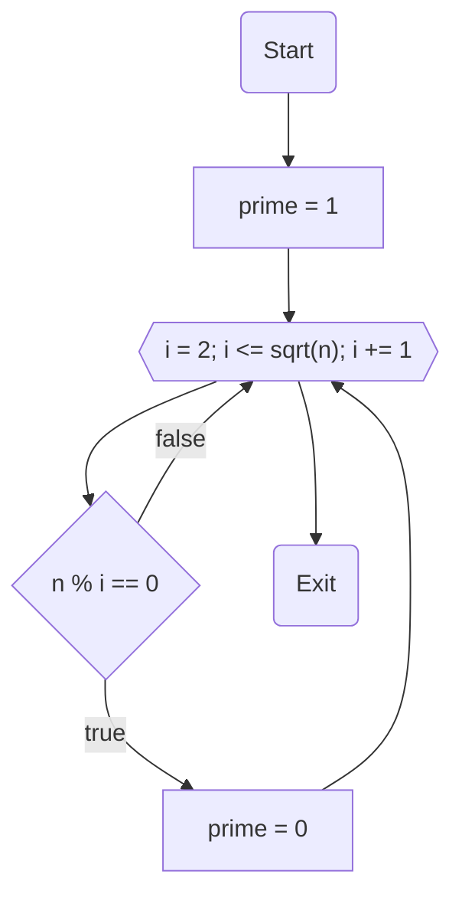

# НИЯУ МИФИ. Лабораторная работа №7. Краснопольский Иван, Б21-525. 2023

## Используемая система

### Используемая система:

```text
System:
  Kernel: 6.2.0-20-generic arch: x86_64 bits: 64 compiler: gcc v: 12.2.0
    Distro: Ubuntu 23.04 (Lunar Lobster)
CPU:
  Info: 32x 1-core model: Intel Xeon (Icelake) bits: 64 type: SMP smt: <unsupported>
    arch: Tremont Snow Ridge rev: 0 cache: L1: 32x 64 KiB (2 MiB) L2: 32x 4 MiB (128 MiB)
    L3: 32x 16 MiB (512 MiB)
  Speed (MHz): avg: 2195 min/max: N/A cores: 1: 2195 2: 2195 3: 2195 4: 2195 5: 2195 6: 2195
    7: 2195 8: 2195 9: 2195 10: 2195 11: 2195 12: 2195 13: 2195 14: 2195 15: 2195 16: 2195 17: 2195
    18: 2195 19: 2195 20: 2195 21: 2195 22: 2195 23: 2195 24: 2195 25: 2195 26: 2195 27: 2195
    28: 2195 29: 2195 30: 2195 31: 2195 32: 2195 bogomips: 140469
```

### Среда разработки

- Язык программирования C
- Версия gcc: `11.4.0`
- Версия OpenMP: `Release: 201511 OpenMP: 4.5`

## Анализ алгоритма

### Принцип работы

Сначала алгоритм проверяет, меньше ли число n двух, так как простые числа начинаются с 2. Если число больше или равно
2, алгоритм вычисляет квадратный корень из n и затем проверяет каждое число от 2 до корня включительно. Если n делится
нацело текущее число, n не является простым числом. Иначе n - простое число.

### Блок-схема



## Входные данные

| Процессы MPI | Потоки OpenMP | Размер рабочей области |
|:------------:|:-------------:|:----------------------:|
|     `16`     |      `2`      |   `0 ... 100000000`    |

## Вычисления

- Последовательный алгоритм

  ```text
  Prime numbers between 0 and 100000000: 5761455
  Execution time: 126.956513
  ```

- <details>
  <summary>Параллельный алгоритм</summary>

  ```text
  Process	Time		Primes
  0	7.706141	428816
  1	10.951821	389887
  2	11.478315	377430
  3	11.940360	369794
  4	9.385363	364470
  5	12.521296	359953
  6	12.849270	356777
  7	10.357847	354007
  8	10.570144	351258
  9	13.462654	349095
  10	13.627450	347345
  11	11.106628	345472
  12	14.528119	343976
  13	14.625438	342183
  14	11.742153	341020
  15	14.247728	339972
  Total: 5761455
  ```
  </details>

## Экспериментальные данные

| Время последовательного алгоритма | Время параллельного алгоритма | Ускорение  | Эффективность |
|:---------------------------------:|:-----------------------------:|:----------:|:-------------:|
|           `126.956513`            |          `14.625438`          | `8.680527` |  `0.271266`   |

### Распределение вычислительной нагрузки


## Заключение

В данном исследовании мы разработали программу, сочетающую технологии OpenMPI и OpenMP, для выполнения алгоритма поиска
простых чисел в определённом диапазоне. Программа использовала концепцию распределения рабочей нагрузки, применяя 16
процессов MPI и 2 потока OpenMP на компьютере с 32 ядрами. Основываясь на этом распределении, мы измерили время
выполнения для каждого процесса и подсчитали количество найденных простых чисел в каждой подзадаче. Анализируя время
выполнения алгоритма, его ускорение и эффективность по сравнению с последовательным выполнением, мы пришли к следующим
выводу, что время выполнения каждого процесса линейно увеличивалось с увеличением его номера. Это подтверждалось
уменьшением числа найденных простых чисел с ростом номера процесса, что соответствует увеличению числа проверок на
делимость и наблюдению, что в более высоких интервалах простых чисел становится меньше.

## Приложение

### Последовательная программа

<details>
  <summary>Исходный код последовательной программы</summary>

```c++
#include <stdio.h>
#include <stdlib.h>
#include <math.h>
#include <omp.h>

int check_prime(int n) {
    if (n < 2) {
        return 0;
    }

    int bound = (int) sqrt(n);
    for (int i = 2; i <= bound; i++) {
        if (n % i == 0) return 0;
    }

    return 1;
}

int main(int argc, char **argv) {
    if (argc != 3) {
        fprintf(stderr, "Usage: %s <start> <end>\n", argv[0]);
        exit(EXIT_FAILURE);
    }

    int start = atoi(argv[1]);
    int end = atoi(argv[2]);

    int primes = 0;
    double start_time, end_time;

    start_time = omp_get_wtime();

    for (int n = start; n <= end; n++) {
        primes += check_prime(n);
    }

    end_time = omp_get_wtime();

    printf("Prime numbers between %d and %d: %d\n", start, end, primes);
    printf("Execution time: %f\n", end_time - start_time);

    return 0;
}
```

</details>

### Параллельная программа

<details>
  <summary>Исходный код параллельной программы</summary>

```c++
#include <stdio.h>
#include <stdlib.h>
#include <math.h>
#include <omp.h>
#include <mpi.h>

void check_prime(int n, int *primes) {
    int prime = 1, bound = (int) sqrt(n);

    if (n < 2) {
        prime = 0;
    }

#pragma omp parallel shared(prime, bound)
    {
#pragma omp for
        for (int i = 2; i <= bound; i++) {
            if (n % i == 0) prime = 0;
            if (prime == 0) i = bound + 1;
        }
    }

    if (prime) {
#pragma omp critical
        {
            *primes += 1;
        }
    }
}

int main(int argc, char **argv) {
    MPI_Init(&argc, &argv);

    int rank, size;
    MPI_Comm_size(MPI_COMM_WORLD, &size);
    MPI_Comm_rank(MPI_COMM_WORLD, &rank);

    if (argc != 3) {
        if (rank == 0) {
            fprintf(stderr, "Usage: %s <start> <end>\n", argv[0]);
        }
        MPI_Finalize();
        exit(EXIT_FAILURE);
    }

    int start = atoi(argv[1]);
    int end = atoi(argv[2]);

    int chunk = (end - start + 1) / size;
    int rem = (end - start + 1) % size;

    int local_start = start + rank * chunk;
    int local_end = local_start + chunk - 1;

    if (rank < rem) {
        local_start += rank;
        local_end += 1;
    } else {
        local_start += rem;
    }

    int result = 0;
    double start_time, end_time;

    int max_threads = omp_get_max_threads();
    int threads = (size > max_threads) ? max_threads / size : 2;
    omp_set_num_threads(threads);

    MPI_Barrier(MPI_COMM_WORLD);

    start_time = MPI_Wtime();

#pragma omp parallel for
    for (int n = local_start; n <= local_end; n++) {
        check_prime(n, &result);
    }

    end_time = MPI_Wtime();

    MPI_Barrier(MPI_COMM_WORLD);

    double benchmark = end_time - start_time;

    double *benchmarks;
    if (rank == 0) {
        benchmarks = (double *) malloc(size * sizeof(double));
    }

    MPI_Gather(&benchmark, 1, MPI_DOUBLE, benchmarks, 1, MPI_DOUBLE, 0, MPI_COMM_WORLD);

    int* results;
    if (rank == 0) {
        results = (int*)malloc(size * sizeof(int));
    }

    MPI_Gather(&result, 1, MPI_INT, results, 1, MPI_INT, 0, MPI_COMM_WORLD);

    if (rank == 0) {
        printf("Process\tTime\tPrimes\n");
        for (int i = 0; i < size; i++) {
            printf("%d\t%f\t%d\n", i, benchmarks[i], results[i]);
        }

        int total_result = 0;
        for (int i = 0; i < size; i++) {
            total_result += results[i];
        }

        printf("Total: %d\n", total_result);

        free(benchmarks);
        free(results);
    }

    MPI_Finalize();

    return 0;
}
```

</details>
